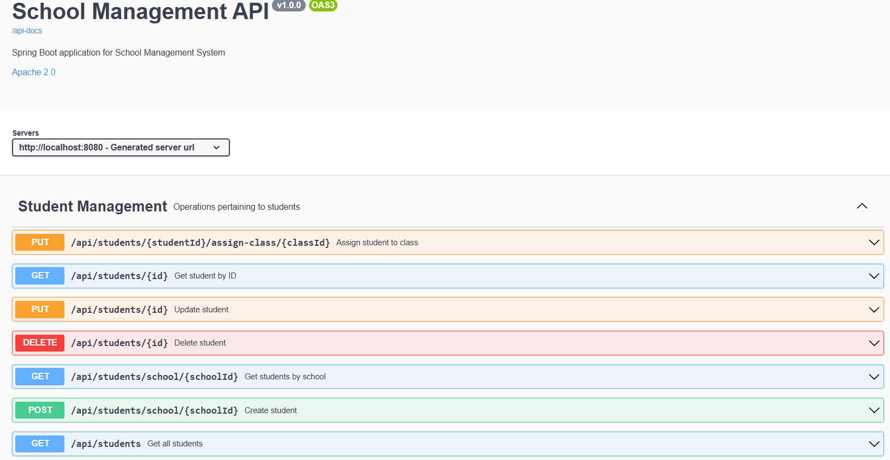
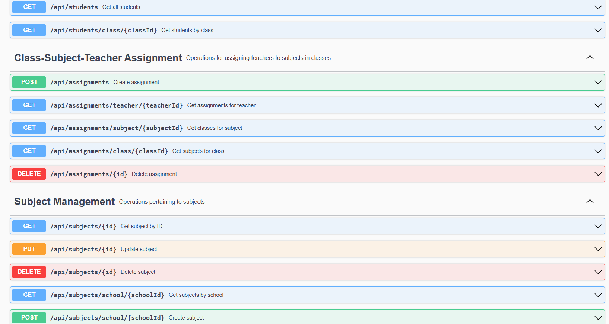
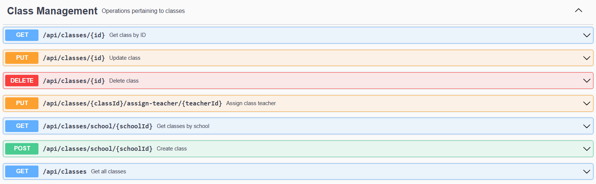
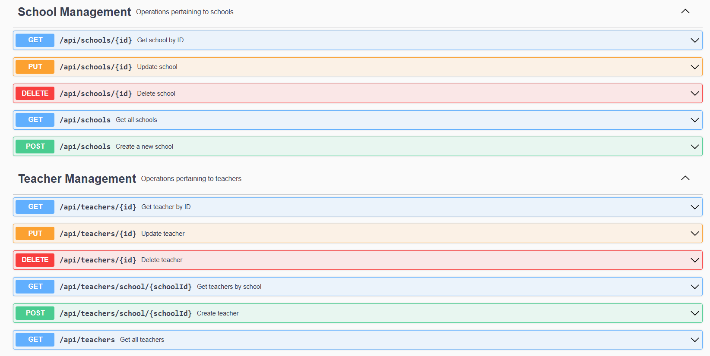

# 🏫 School Management System with RESTFUL APIs

## 📌 Project Overview

A Spring Boot Application with several RESTful API for managing school data including **school**, **students**, **teachers**, **classrooms**, and **subjects**. It provides:

- Full CRUD operations using JPA/Hibernate
- PostgreSQL backend (Docker-ready)
- OpenAPI documentation via Swagger UI
- Clean REST architecture

---

## 🌟 Key Features

- **User Management**: Manage schools, students, teachers, and their relationships
- **Class Organization**: Assign subjects to classrooms (many-to-many)
- **API Documentation**: Auto-generated Swagger UI via OpenAPI 3
- **Containerized**: Easily deployable using Docker & Docker Compose

---

## 🛠 Tech Stack

| Category    | Technologies Used              |
|------------|-------------------------------|
| Backend     | Spring Boot 3, Java 17         |
| Database    | PostgreSQL (Docker), H2 (local dev) |
| OpenAPI Docs    | SpringDoc OpenAPI 3            |
| Deployment  | Docker, Docker Compose         |
| Build Tool  | Maven                          |

---

---

## 📸 API Preview (Swagger UI)

Take a look at how the API is structured and documented using Swagger UI:

| Endpoint Group                     | Preview                                                  |
|------------------------------------|----------------------------------------------------------|
| **Student & School APIs**          |                   |
| **Subject and Assignment APIs**    |                   |
| **Classroom & Teacher Assignment** |               |
| **School & Teacher Management**    |   |

---

## 🚀 Quick Start

### ▶️ With Docker

```bash
docker-compose up --build
```

- API: [http://localhost:8080](http://localhost:8080)
- Swagger Docs: [http://localhost:8080/swagger-ui.html](http://localhost:8080/swagger-ui.html)
- PgAdmin: [http://localhost:5050](http://localhost:5050)  
  - **Email**: `admin@school.com`  
  - **Password**: `admin`

### ▶️ Without Docker

```bash
mvn spring-boot:run
```

- H2 Console: [http://localhost:8080/h2-console](http://localhost:8080/h2-console)  
  - JDBC URL: `jdbc:h2:mem:school_db`

---

## 🎯 Perfect For

- Learning Spring Boot & JPA
- Practicing entity relationships
- Dockerizing Java applications
- Building REST APIs with OpenAPI documentation

---


## 🤝 Contributions

Pull requests are welcome! For major changes, please open an issue first to discuss what you'd like to change.
